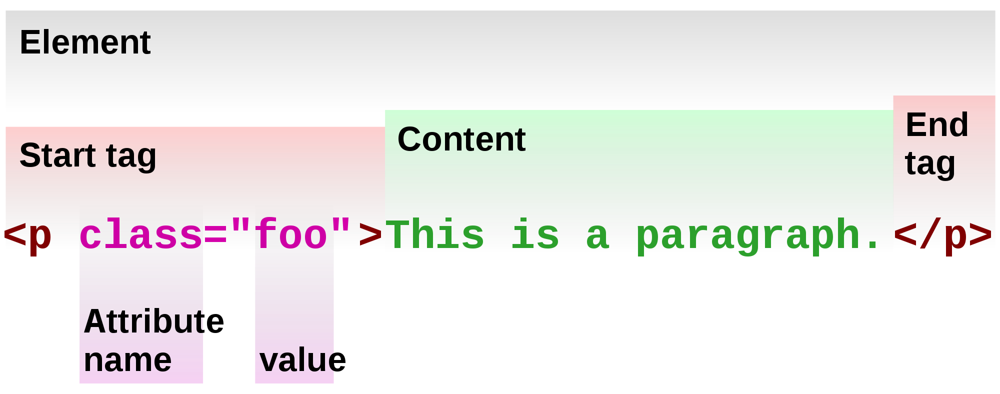

You can skip this section if you already know basic HTML and CSS. We're going to cover a quick overview of all the basic HTML components as well as basic CSS structure, but you can read something a little more thorough [here (HTML)](https://www.w3schools.com/html/html_intro.asp) and [here (CSS)](https://www.w3schools.com/css/css_intro.asp), or click on any of the links throughout the note. At the end of this note we will set up the basic structure of our webpage.

# HTML Basics


`<tag></tag>`
Each html element is contained in a set of "tags".

# Basic Elements
The following is an example of a very basic HTML structure. We will be briefly explaining each piece of it.

```html
<!DOCTYPE HTML>
<html>
    <head>
      <title>Page Title</title>
      <link rel="stylesheet" href="main.css">
      
      <style>
        /*CSS styling can go here*/
      </style>
    </head>
    
    <body>
      <h1>Hello, World!</h1>
      <p>This is the basic structure of HTML.</p>
      
      <script>
        //This is where we will write our Javascript
      </script>
      
    </body>
</html>
```

## [`<!DOCTYPE HTML>`](https://www.w3schools.com/tags/tag_doctype.asp)
Declares the document to be HTML5.

## [`<html>`](https://www.w3schools.com/tags/tag_html.asp)
Contains all the HTML content.

## [`<head>`](https://www.w3schools.com/tags/tag_head.asp)
Contains metadata, scripts, page title, styles, and more.
### [`<title>`](https://www.w3schools.com/tags/tag_title.asp)
The title of the website that appears in the browser tab.
### [`<link>`](https://www.w3schools.com/tags/tag_link.asp)
Links to external stylesheets such as CSS, fonts, and more.
### [`<style>`](https://www.w3schools.com/tags/tag_style.asp)
Contains CSS that styles the HTML.

## [`<body>`](https://www.w3schools.com/tags/tag_body.asp)
Contains all visible content.
### [`<script>`](https://www.w3schools.com/tags/tag_script.asp)
Contains Javascript that styles the HTML or links to external script files.
### [`<h1>, <h2> ... <h6>`](https://www.w3schools.com/tags/tag_hn.asp)
Defines a heading, with 1 being the largest and 6 the smallest.
### [`<p>`](https://www.w3schools.com/tags/tag_p.asp)
Defines a paragraph.
### [`<!--Comment-->`](https://www.w3schools.com/tags/tag_comment.asp)
Defines text that is used to explain code, but does not display on the webpage. You will see a lot of comments in our examples that explain what each section of code is for.

# [Attributes](https://www.w3schools.com/html/html_attributes.asp)
Attributes are used to define extra information about an element. They are always placed in the start tag and are usually written as `name="value"` (ex. `<p id="first"></p>`). 

## [Id](https://www.w3schools.com/html/html_id.asp)
A unique identifying value for the element. Used to style that specific element and select it with Javascript.
Ex. `<p id="big"></p>`

## [Class](https://www.w3schools.com/html/html_classes.asp)
Similar to the id attribute, a class is used to identify specific elements. However, one class can be applied to multiple elements, unlike the id tag where each is unique. This is very useful if, for example, you want to style several similar elements the same way.
Ex. `<p class="small"></p>`

## [Style](https://www.w3schools.com/tags/att_global_style.asp)
Provides in-line CSS. This takes precedence over CSS written anywhere else
Ex. `<p style="color: blue">Blue Text</p>`


# CSS Basics
CSS is used to change how HTML elements are viewed.


## [Selector](https://www.w3schools.com/css/css_syntax.asp)
Selects the element(s) you want to style. This could be an element type (such as all h1 tags), an id, class, etc. 

An id is selected by writing a hash character in front of the name (ex. `#big {...}`) and a class is selected with a period in front of it (ex. `.small {...}`). 

You can combine selectors as well. If you wanted to make all `<p>` elements with the class "red" have red text, you would use `p.red {color: red;}`.

There are *a lot* more selectors that are not covered here. You can learn more about them [here](https://www.w3schools.com/cssref/css_selectors.asp). More selectors will also be explained as we use them in our webpage.

## Properties
There are much too many properties to list here. As we go through the process of creating our start up page, you'll learn how to use most of the basics. You can also view a list of every property [here](https://www.w3schools.com/cssref/default.asp).

## ```/*Comment*/```
Just like in HTML, we will be using CSS comments to further explain our code.

# Putting it Together
Test out what you've learned to create your first basic website! Try playing around with different elements and styles to get a feel for how it all works.

```HTML
<!DOCTYPE HTML>
<html>
    <head>
      <title>Title</title>
      
      <style>
        h1 {
          color: red;
          text-align: center;
        }
      </style>
    </head>
    
    <body>
      <h1>Hello, world!</h1>
    </body>
</html>
```

# Setting Up Our Page
Now that you know some the basics, we can set up the basic structure for our website:

```HTML
<!DOCTYPE HTML>
<html>
    <head>
      <!--Title-->
      <title>Start Up Page</title>
      
      <!--Tab icon-->
      <link rel="shortcut icon" href="images/icon.png" rel="stylesheet">
      
      <!--Stylesheet-->
      <link rel="stylesheet" href="main.css">
    </head>
    
    <body>
      <!--This is where our content will go-->
      
      <script>
        //This is where we will write our Javascript
      </script>
    </body>
</html>
```
