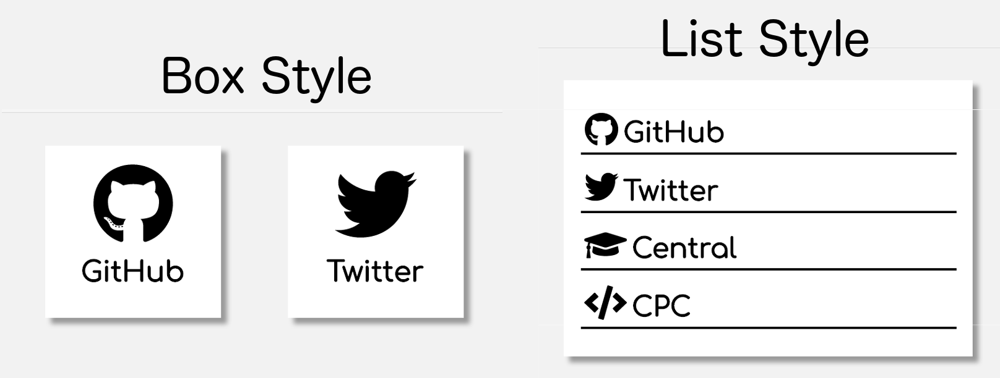
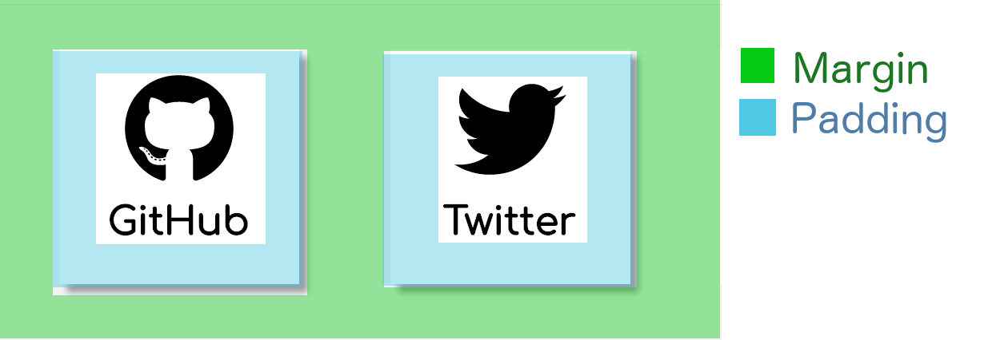
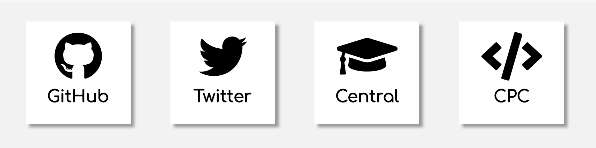
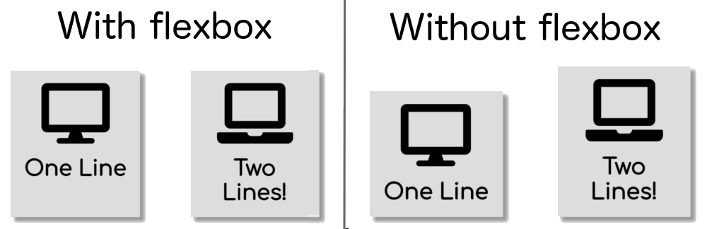
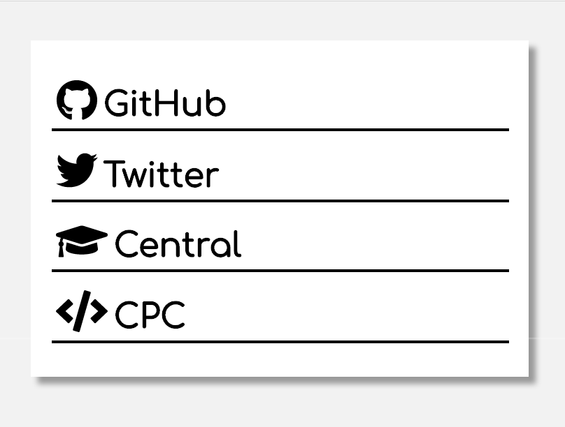
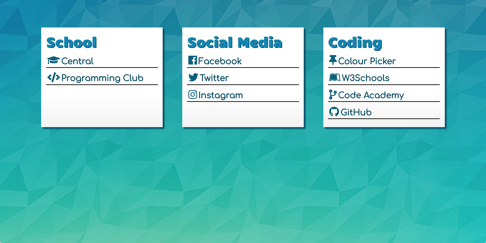

# Overview
Our links will contain three parts: the container that holds each link, the links within the container, and the icon/website name within the links. The end result will look like this:

```HTML
<div id="link-container">
  <a class="link" href="put website link here">
    <i class="icon fas fa-icon-name"></i>
    <h2>Website Name</h2>
  </a>
  <!--More links can be added here-->
</div>
```

# Link Container
```HTML
<div id="link-container">
  <!--our links will go here-->
</div>
```
The `<div>` tag defines a section, and in this case it will be the section containing all of our links. We give it the *link-container* id so that we can add styling to it later.

# The Links
```HTML
<div id="link-container">
  <a class="link" href="put website link here">
    <h2>Website Name</h2>
  </a>
  <a class="link" href="put website link here">
    <h2>Website Name</h2>
  </a>
  <!--More links can be added here-->
</div>
```

The `<a>` tag defines a link, with the href attribute being the url. Since we'll be using multiple links with the same styling, we give them all the same class, *link*. Inside of those links, we want to place a heading so that we can identify which link is which.

# Icons
To make our website links look better, we can add icons. Images can also be used, but here we will cover using <a href="https://fontawesome.com/" target="_blank">Font Awesome</a> icons.

To use these icons, we first have to link to the Font Awesome library somewhere between our head tags:

```html
<head>
  ...
  <!--Font awesome icons-->
  <script defer src="https://use.fontawesome.com/releases/v5.0.8/js/all.js"></script>
  ...
  </head>
```

Whenever you want to use an icon, simply search for the one you want <a href="https://fontawesome.com/icons?d=gallery" target="_blank">here</a>, and then use an `<i>` tag with the corresponding class. To make the icon easier to style, we can also add an *icon* class to the element:

```HTML
<a class="link" href="put website link here">
  <i class="icon fas fa-icon-name"></i>
  <h2>Website Name</h2>
</a>
```
You can learn more about using/styling Font Awesome icons <a href="https://fontawesome.com/how-to-use/svg-with-js" target="_blank">here</a>.

# Add Some Style
Feel free to play around with it to create any design you want. Here we will show two different designs that you can experiment with.


If you'd like to add custom fonts, there's a large selection available at <a href="https://fonts.google.com/" target="_blank">Google Fonts</a> that is easy to add to your site.

## Margin and Padding
Before we add the CSS, it's important to understand the difference between margin and padding. Padding creates empty space *within* an element, while margin creates space *outside* of it.


You can learn more about the CSS Box Model <a href="https://www.w3schools.com/css/css_boxmodel.asp" target="_blank">here</a>.

## Common CSS
In both designs we will be using the following CSS:

```CSS
* { /*this selects everything*/
    margin: 0; /*prevents unwanted margins*/
    box-sizing: border-box; /*include padding and border in an element's dimensions*/
}
body {
   background-color: #f2f2f2;
}
h2 {
    font-size: 25px; /*px stands for pixels*/
    font-family: "Comfortaa", cursive; /*you can choose any font from Google fonts*/
    color: #000; /*the hex code for black*/
}
```
You can use this <a href="https://www.w3schools.com/colors/colors_picker.asp" target="_blank">HTML Color Picker</a> to find colour codes.

## Box Style


To make the boxes equal height despite the amount of content in them, we can use <a href="https://css-tricks.com/snippets/css/a-guide-to-flexbox/" target="_blank">flexbox</a>. 



```CSS
#link-container {
    display: -webkit-box; /*browser-specific prefixes*/
    display: -ms-flexbox;
    display: -webkit-flex;
    display: flex;
    justify-content: center; /*centre the boxes*/
    flex-wrap: wrap; /*allows content to go on more than one line if window is too small*/
}
```
And now we style the links. Try experimenting with different values and properties.
```CSS
.icon {
    margin-bottom: 15px; /*add space between icon and heading*/
    font-size: 70px;
    color: #000;
}
.link {
    width: 150px;
    margin: 2%; /*sets margin to 2% of element's width*/
    padding: 1%;
    cursor: pointer; /*change the cursor to indicate clickable content*/
    text-align: center;
    text-decoration: none; /*removes normal link styling (underline)*/
    background-color: #fff;
    box-shadow: 5px 5px 5px #999; /*add shadow (values are horizontal-offset, vertical-offset, blur, and colour)*/
    transition: box-shadow 0.5s; /*adds transition (as seen on hover effect)*/
}
.link:hover { /*deepen shadow on hover*/
    box-shadow: 7px 7px 10px #999;
}
```

## List Style


```CSS
 #link-container {
   width: 25%;
   margin: 2%;
   padding: 1%;
   background-color: #fff;
   box-shadow: 5px 5px 5px #999;
}
 .icon {
   font-size: 30px;
   color: #000;
}
 .link {
   width: 100%;
   margin: 3% 0; /*top and bottom margin 3%, left and right 0*/
   padding: 1%;
   display: block;
   cursor: pointer;
   text-decoration: none;
   border-bottom: 2px solid #000;
   transition: background-color 1s;
}
 .link i, .link h2 {
   display: inline-block; /*display side by side*/
   }
 .link:hover {
   background-color: #e6e6e6;
}
```

# Customize

Feel free to add additional components/styling at any time! Some ideas of things you could add at this point:
- <a href="https://www.w3schools.com/css/css_background.asp" target="_blank">background image</a>
- multiple lists with categories
- list/box background images
- <a href="https://www.w3schools.com/css/css3_borders.asp" target="_blank">round corners</a>
- <a href="https://www.w3schools.com/css/css3_border_images.asp" target="_blank">image borders</a>
- <a href="https://www.w3schools.com/css/css3_gradients.asp" target="_blank">gradients</a>
- <a href="https://www.w3schools.com/howto/howto_js_accordion.asp" target="_blank">accordions (collapsible links)</a>
- <a href="https://www.w3schools.com/howto/default.asp" target="_blank">anything else</a> you can think of!


## Example

