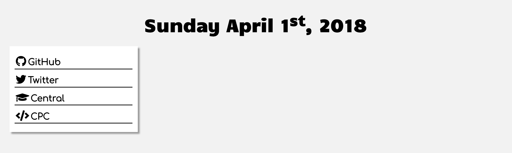

To display the date you can use a library such as [Datejs](http://www.datejs.com/) or [Moment.js](https://momentjs.com/) (which is more complicated to set up but simpler to use), or manipulate JavaScript's built-in date methods. You can view an introduction to Javascript [here](https://www.w3schools.com/js/js_intro.asp), but you don't have to know any to follow along.

# Month, Day, and Year
To get started, add a heading where the date will be displayed.
```HTML
<h1 id="date"></h1>
```
We will then use JavaScript to insert the current date into the heading by selecting the id we gave it:
```JavaScript
var date = new Date(); //Get the current date
var month = date.getMonth(); //Get month from the full date
var day = date.getDate(); //Get day number from the full date
var year = date.getFullYear(); //Get year from the full date

document.getElementById("date").innerHTML = month + " " + day + ", " + year; //Set the date heading text
```

# Add Month Names
To show the name of the month rather than the number, we can create an array containing all of the names,  then access the index of the array containing the month number. You can read more about JavaScript arrays and arrays in general [here](https://www.w3schools.com/js/js_arrays.asp).

```JavaScript
var monthNames = ["January", "February", "March", "April", "May", "June", "July", "August", "September", "October", "November", "December"];

document.getElementById("date").innerHTML = monthNames[month] + " " + day + ", " + year;
```

# Add Days of the week
The same thing can be done to write out the day.

```JavaScript
var weekday = date.getDay();

var dayNames = ["Sunday", "Monday", "Tuesday", "Wednesday", "Thursday", "Friday", "Saturday"];

document.getElementById("date").innerHTML = dayNames[weekday] + " " + monthNames[month] + " " + day +  ", " + year;
```

# Add the Ordinal Indicator
The ordinal indicator is the letters that succeed a number (ex 1<sup>**st**</sup>, 2<sup>**nd**</sup>, 3<sup>**rd**</sup>);

| Indicator | Days            |
| --------- | --------------- |
| st        | ends in 1       |
| nd        | ends in 2       |
| rd        | ends in 3       |
| th        | everything else |

The exception to these rules are numbers in the "teens" which always use "th" (ex 11<sup>th</sup>).

We can determine what number a day ends in using the modulus/remainder operator. When we divide the number by ten, the remainder will be the last number.

```JavaScript
var orInd = "th";

if(day % 10 == 1 && day!=11){
  orInd = "st";
}
else if(day % 10 == 2 && day!=12){
   orInd = "nd";
}
else if(day % 10 == 3 && day!=13){
  orInd = "rd";
}

document.getElementById("date").innerHTML = dayNames[weekday] + " " + monthNames[month] + " " + day + "<sup>" + orInd + "</sup>" + ", " + year;
```

# Add Styling
``css
h1 {
    font-size: 50px;
    font-family: "Candal", sans-serif;
}
#date {
    margin: 2% 0 3%; /*top 2%, left and right 0, bottom 3%*/
    text-align: center;
}
``

# End Result


You can customize the date further from here. What about adding the time? What if you don't want it in the standard 24-hour time? How could you format it?